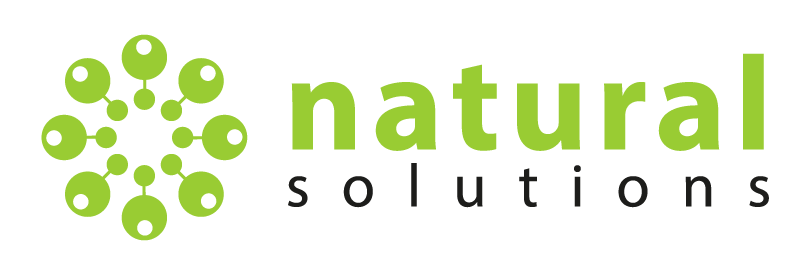

# GeoCam

## Bienvenue sur la documentation de GeoCam

---

## Introduction

GeoCam est un outil développé par Natural Solutions dans le but d'aider les acteurs de la biodiversité à exploiter le potentiel des pièges photographiques. Cet outil permet de faciliter la gestion et le traitement des données de biodiversité issues de ces pièges.

