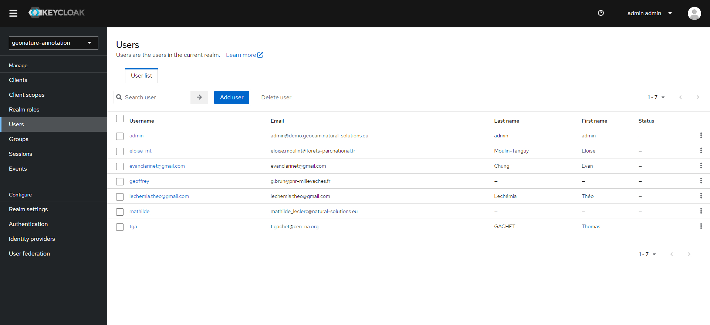
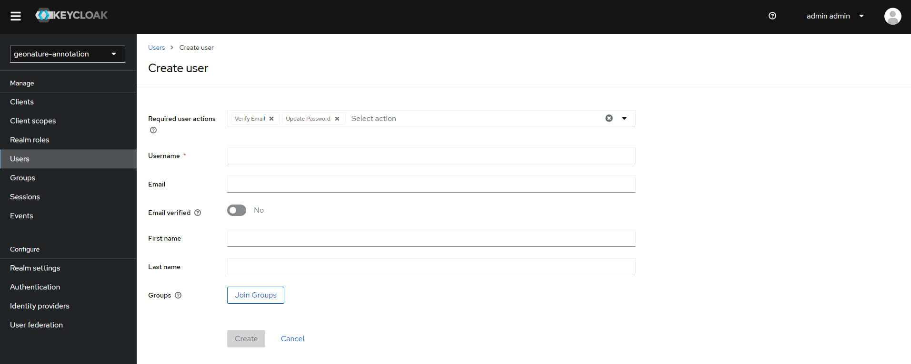
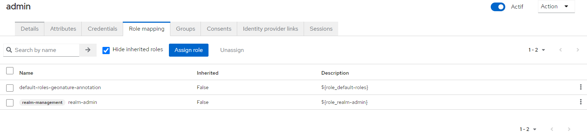
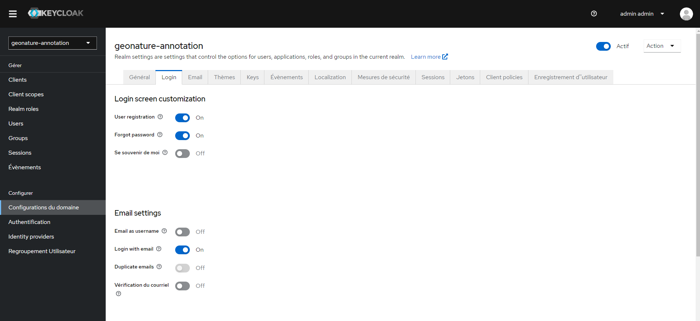
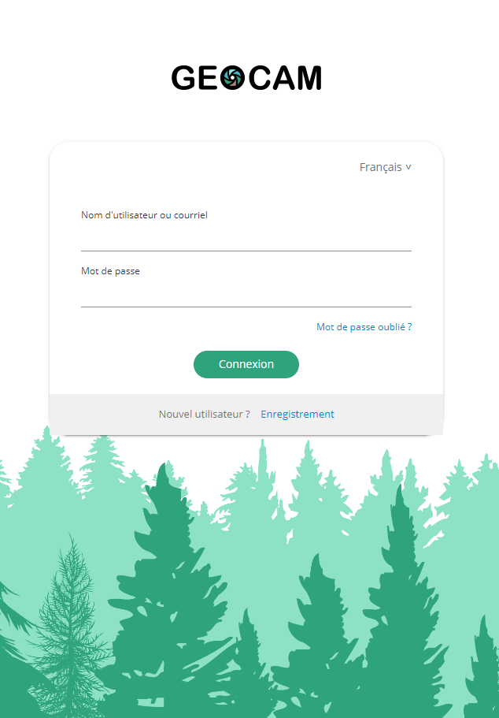

# Utilisation de l'interface d'administration de keycloak

## Création de compte utilisateur

Vous pouvez créer autant de compte utilisateur que vous le souhaitez depuis l'onglet _users_ dans le menu de gauche (/auth/admin/geonature-annotation/console/#/geonature-annotation/users) : 

1- Cliquer sur "Add user"  
2- Remplir les champs obligatoires marqués par une astérisques rouge et le champ email à minima 
3- Nous vous conseillons de sélectionner "verify email" et "update password" pour le premier champs comme ci-dessous:

4- Cliquer sur "create"  
5- Dans l'onglet _Credential_, cliquer sur "set password" pour créer un mot de passe temporaire à changer lors de la première connexion  
6- Vérifier dans l'onglet _role mapping_ que l'utilisateur a le rôle "default-roles-geonature-annotation"

## Création de compte administrateur

Suivez la même procédure qu'au-dessus pour créer l'utilisateur puis aller dans l'onglet _role mapping_ et attribuer lui le rôle "realm-admin".

## Réinitialisation du mot de passe d'un utilisation

Dans l'onglet _users_ cliquer sur l'utilisateur en question et aller dans _credentials_ puis cliquer sur "reset password"

## Gestion des fonctionnalités de connexion

Il est possible de configurer certaines fonctionnalités de la page de connexion dans l'onglet _login_ comme ci-dessous :

Il y a, par exemple, la possibilité d'activer la fonctionnalité de **mot de passe oublié** et de demande de **création de compte** sur la page de connexion de l'application.

