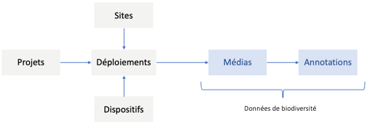

Le **projet** est l’entité de base au sein de l’application. Cette entité contient quelques champs basiques facultatifs. Seul le nom est obligatoire. C’est au sein d’un projet que vous pouvez créer des **déploiements**. Le déploiement est l’entité qui relie un piège photographique (ou **dispositif**) et un **site** (localisation (x,y) où a été posé le piège).
