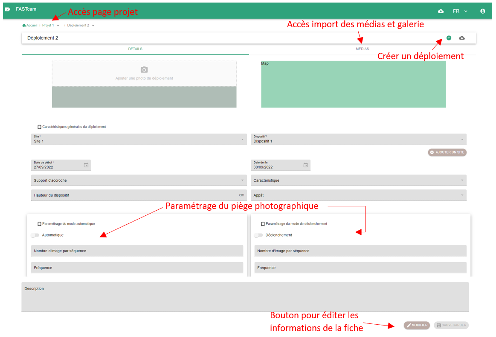

## Qu'est-ce qu'un déploiement ?

Le déploiement correspond à la localisation d’un dispositif donné sur une période définie par une date de début de déploiement et une date de fin de déploiement. Plusieurs autres caractéristiques peuvent lui être attribué comme des informations sur le placement du dispositif (hauteur et type de fixation), la présence d’appât... Les déploiements permettent au sein de l’outil de relier les médias à leur site, dispositif et projet respectif.

## Page déploiement

