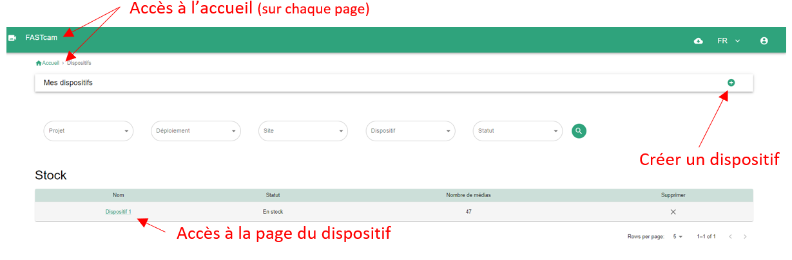
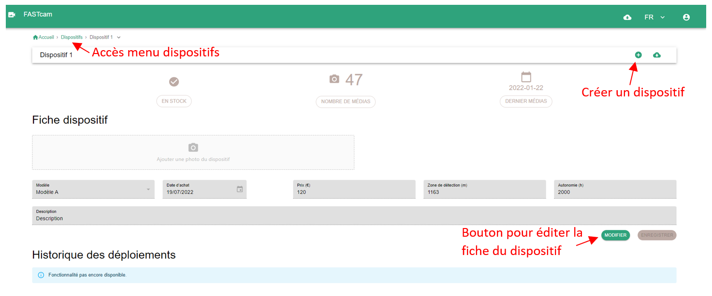

## Qu'est-ce qu'un dispositif ?

Un dispositif correspond, ici à un piège photographique. Les pièges photographiques ont plusieurs caractéristiques propres: le modèle, la date d'achat, les caractéristiques techniques (zone de détection...), l’autonomie, une description, etc.

## Menu des dispositifs

Cette page est accessible via la bouton "nombre de dispositifs" sur la page d'accueil. 
Sur cette page est présenté l'ensemble des dispositifs qui ont été enregistrés dans l'instance. Il est possible depuis cette page de créer un nouveau dispositif.

_Page de menu des dispositifs_

## Page dispositif

Cette page est accessible en cliquant sur le nom d'un dispositif dans le menu des dispostifs.  
Cette page présente simplement les caractéristiques d'un dispositif.

