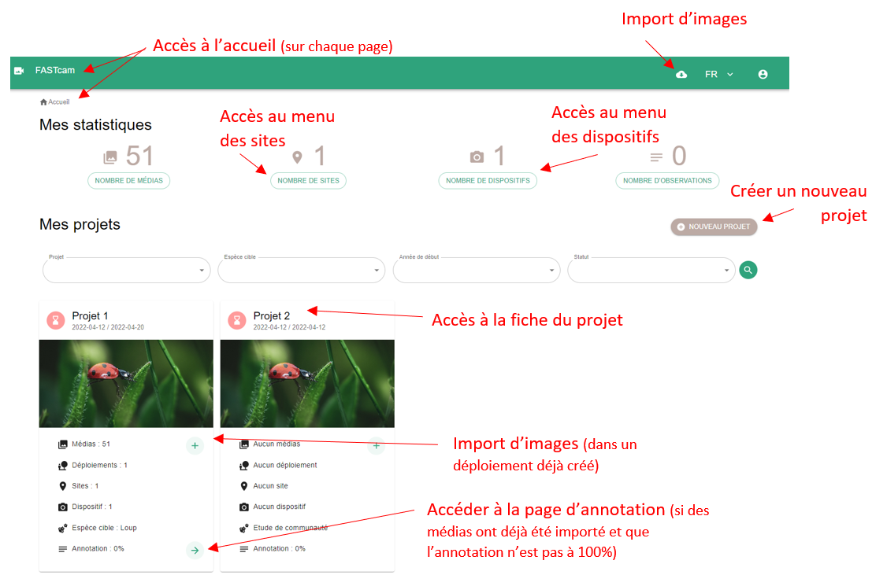

# Accueil de ecoSecrets

La page d'accueil présente des informations générales sur l'instance : le nombre de sites et de dispositifs, le nombre d'observations effectuées et le nombre de médias importés.
  
Sur cette même page est accessible le menu des projets sous forme de cartes informatives de l'ensemble des projets enregistrés dans l'instance.

La figure suivante présente l'ensemble des fonctionnalités accessible depuis la page d'accueil.
 

_Page d'accueil de ecoSecrets_

