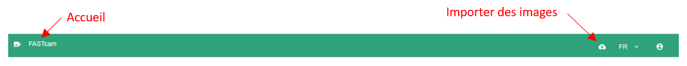
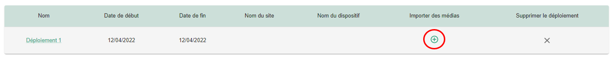
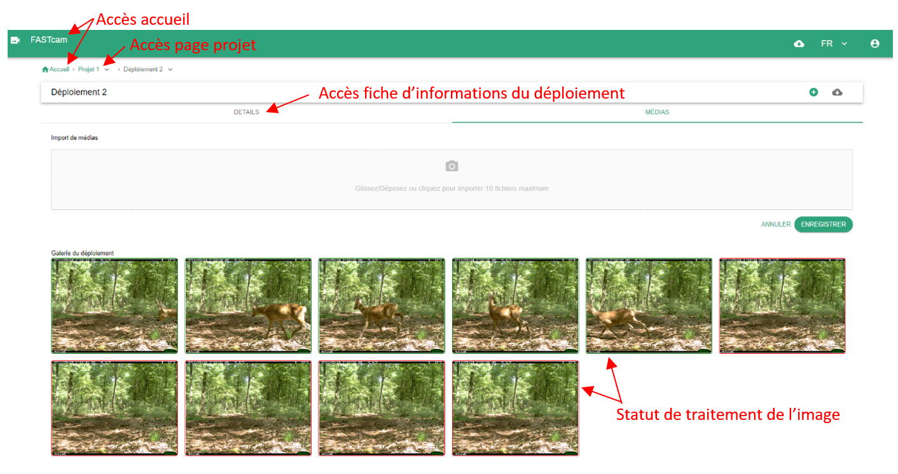

## Comment importer des images ?

Pour pouvoir importer des images il faut avoir, dans un premier temps, créé un projet et un déploiement (et donc aussi un site et un dispositif).
Une fois les différents objets créés, vous pouvez importer des images :  

- depuis toutes les pages grâce à l'icône en haut à droite  
  
- depuis l'accueil grâce au bouton + en face du nombre de médias sur la carte d'un projet  
- depuis la page projet: en cliquant sur le + du déploiement associé dans le tableau des déploiements  
  
- depuis la page déploiement dans l'onglet média
  

Source : Zhang, Z., He, Z., Cao, G., & Cao, W. (2016). Animal detection from highly cluttered natural scenes using spatiotemporal object region proposals and patch verification. IEEE Transactions on Multimedia, 18(10), 2079-2092. (bibtex)
