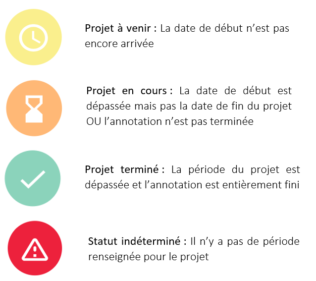
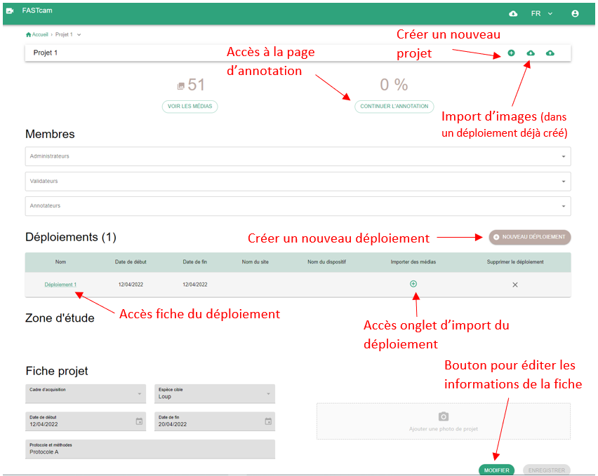

## Qu'est-ce qu'un projet ?

Le projet est l’entité de base au sein de l’outil. C’est dans ce contexte que des déploiements peuvent être créés : 2 éléments de contexte essentiels pour importer et stocker des médias de manière organisée. Un projet contient que des informations basiques comme un nom, une date de début et une date de fin, un taxon cible ainsi qu’un champ permettant la description du protocole et des méthodes employées.

## Statut des projets

## Page projet

Cette page présente l'ensemble des informations d'un projet comme le nombre total d'images importées dans ce projet, le pourcentage d'aavncement du traitement de ces images, sa période...

Sur cette page est disponible la liste des déploiements du projet l'accès leur fiche et la page d'import des médias.

La figure suivante présente les fonctionnalités de cette page:

_Exemple d'une page projet_

