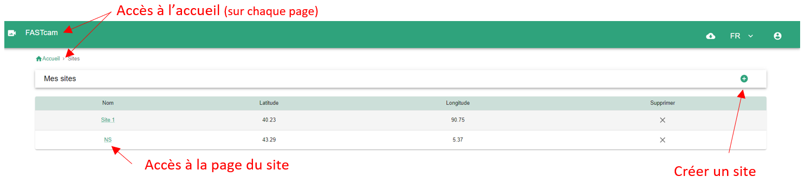
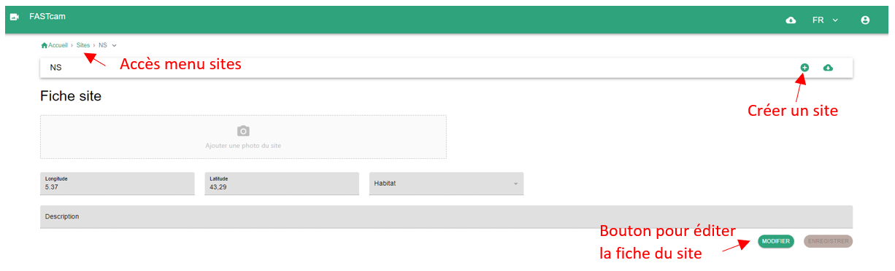

## Qu'est-ce qu'un site ?

Un site au sein de l’outil est une localisation définie par un point géographique de coordonnées (x,y) lié potentiellement à une description.

## Menu des sites

Cette page est accessible via le bouton "nombre de sites" sur la page d'accueil.  
Sur cette page est présenté l'ensemble des sites qui ont été enregistrés dans l'application. Il est possible depuis cette page de créer un nouveau site.

_Page de menu des sites_

## Page site

Cette page est accessible en cliquant sur le nom d'un site dans le menu des dispostifs.  
Cette page présente simplement les caractéristiques d'un site.

