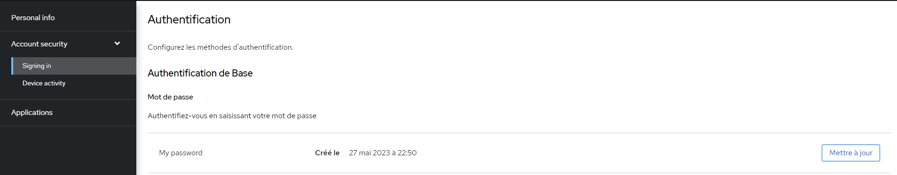

# Compte utilisateur

Vous pouvez accéder à la page concernant votre compte dans l'interface de Keycloak sur `/auth/realms/ecosecrets/account/`.

Pour le moment, seules les informations personnelles sont disponibles. Elles peuvent être modifiées tout comme votre mot de passe dans _Account security_.

